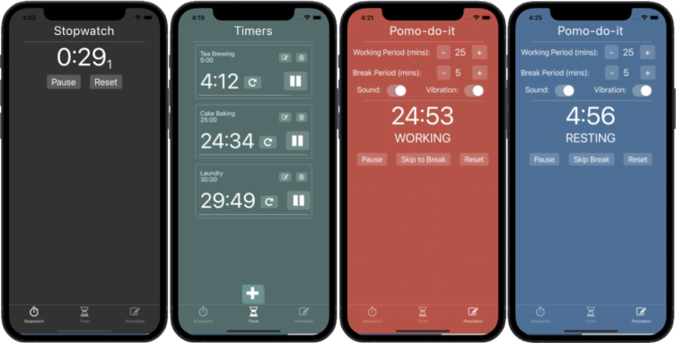

# CS50M Project 1: Pomo-do-it

## CS50 Mobile App Development with React Native

### Project Aims:

The aim of this project was to build a [Pomodoro Timer](https://en.wikipedia.org/wiki/Pomodoro_Technique) App. Users can specify the length of their 'Work' and 'Break' sessions, Start/Pause/Reset the Timer, as well as skip to the next timer phase. In addition, whether the users phone will vibrate and/or an alarm plays as each timer finishes can be selected.

View a demo of the project [here](https://snack.expo.dev/@plcoster/pomo-do-it) (select web or iOS)

### Technologies:

- JavaScript
- **[React](https://reactjs.org/)**, using **[React-Native](https://reactnative.dev/)** components and React Hooks for state management.
- **[PropTypes](https://reactjs.org/docs/typechecking-with-proptypes.html)** for type-checking of props
- **[Expo](https://expo.dev/)** and **[Create-Expo-App](https://www.npmjs.com/package/create-expo-app)** to bootstrap the app boilerplate / development process.

Sound Samples were provided by **[SampleSwap](https://sampleswap.org/)**

Styling was inspired by **[Pomofocus](https://pomofocus.io/)**

### Usage:

Requires Node.js / NPM in order to install required packages. After downloading the repo, install the required dependencies with:

`npm install`

The web development server can then be started with:

`npm run web`
